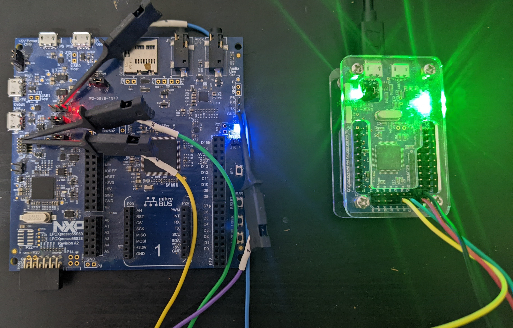

# Debug Authentication in LPC55S6x MCU

## Proof of concept to authenticate Serial-Wire Debug(SWD) access in LPC55S69 devices using Hydrabus. 

Hydrabus(HW) provides low level access to swd protocol using the pyHydrabus framework. The POC is to show how an target microcontroller is used to authenticate a host debugger(hydrabus) with asymmetric key cryptography and to enabe debug access. The LPC55S69 and other similar series of devices uses the ARM Authenticated Debug Access Control Specification to authenticate a debugger using a challenge/response mechanism. More details about the authentication scheme can be found in the below links. NXP also provides an easier approach to use the USB port in the development boards to authenticate the debugger using the [Secure provisioning framework ](https://pypi.org/project/spsdk/). 

1. [Authenticated Debug Access Control Specification](https://developer.arm.com/documentation/den0101/latest)

2. [LPC55S6x User Manual](https://www.nxp.com/products/processors-and-microcontrollers/arm-microcontrollers/general-purpose-mcus/lpc5500-cortex-m33/high-efficiency-arm-cortex-m33-based-microcontroller-family:LPC55S6x?tab=Documentation_Tab)

The reason for using a Hydrabus is to understand in deep how the low level SWD protocol accesses happens when a debugger connects to a target MCU. The same can be done usign a low cost FTDI( ex using OpenOCD). Below are the few blogs to get started with SWD Hydrabus or an FTDI. I prefferd the Hydrabus as a SWD debugger over FTDI because of the support in using pyHydrabus module.  

1. [SWD Protocol Basics - Part 1](https://research.kudelskisecurity.com/2019/05/16/swd-arms-alternative-to-jtag/)

2. [SWD Memory-AP access - Part 2](https://research.kudelskisecurity.com/2019/07/31/swd-part-2-the-mem-ap/)

3. [Programming FTDI devices in Python: Part 4](https://iosoft.blog/2018/12/08/ftdi-python-part-4/)

## Requirements:

### Hardware requirements:

1. [LPC55S69-EVK Development board](https://www.nxp.com/design/development-boards/lpcxpresso-boards/lpcxpresso55s69-development-board:LPC55S69-EVK)
2. [Hydrabus HW](https://github.com/hydrabus/hydrabus)

### Software requirements:

1. Ubuntu 20.04.3 LTS
2. Enable Debug Authentication in the LPC55S69 using the [Application note](https://www.nxp.com/docs/en/application-note/AN13037.pdf) 
3. Install the requirements text for POC.
``` 
pip install -r requirements.txt 
```
4. After enabling the Debug authentication in the MCU, copy the "dck_rsa_2048.dc" and "dck_rsa_2048.pem" into the folder where the tool is running. 
5. Run the tool. 
``` 
python3 swd_lpc55_debug_auth.py
```
### Hardware Connection :

                     ----------  <-----------------> SWD    ---------
                     - Hydra  -  ----------------->  SCLK   - LPC55 -
                     -  Bus   -  ----------------->  GND    -  MCU  -
                     ----------  ----------------->  VCC    ---------                            
                 


### Demo:


### Technical Details:

LPC55S69 MCU provides users to enable/disable debug accesses for field return using an authentication mechanism. The Authentication  uses ARM debug specification to implement challenge/response protocol and signing of debug tokens using asymmetric key cryptography. In a nutshell, the debug authentication mechanism works as below,

1. Developer enables Debug authentication in the MCU and deploys the device in field.  
2. In field return, when a the developer wants to debug the MCU, the target MCU sends a random challenge along with device specific constraints to the debugger. 
3. The debugger prepares a response token signed along with a certficate chain and the challenge value. 
4. The MCU verifies the signature's in the certificate chain against a root of trust fuse and all the debug permisions set in the certificate. 
5. If the verification is success, the MCU opens the MEM-AP port access to the debugger in order to debug the device till the next cold reset.  


